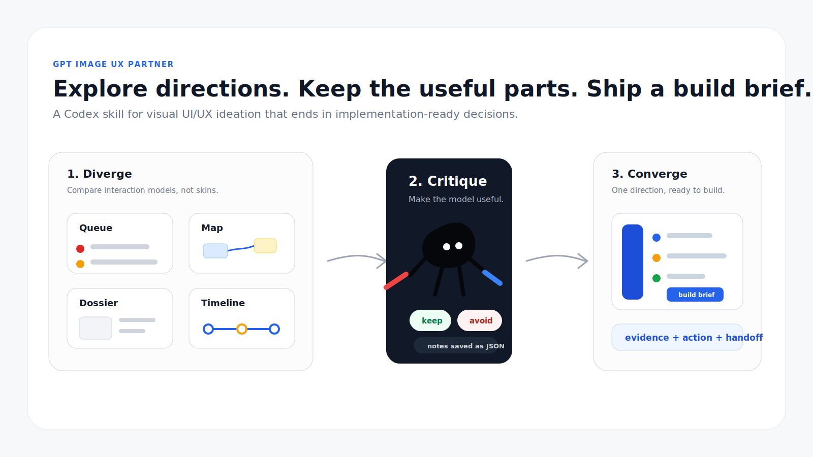
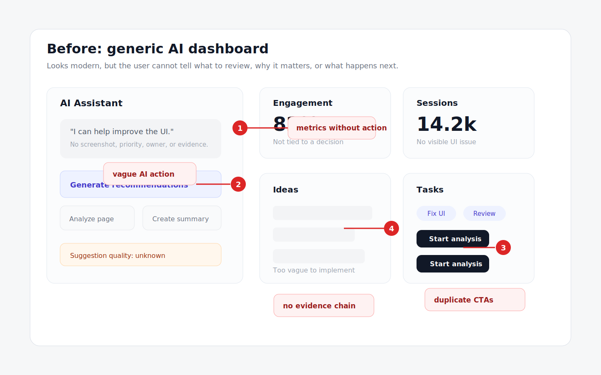
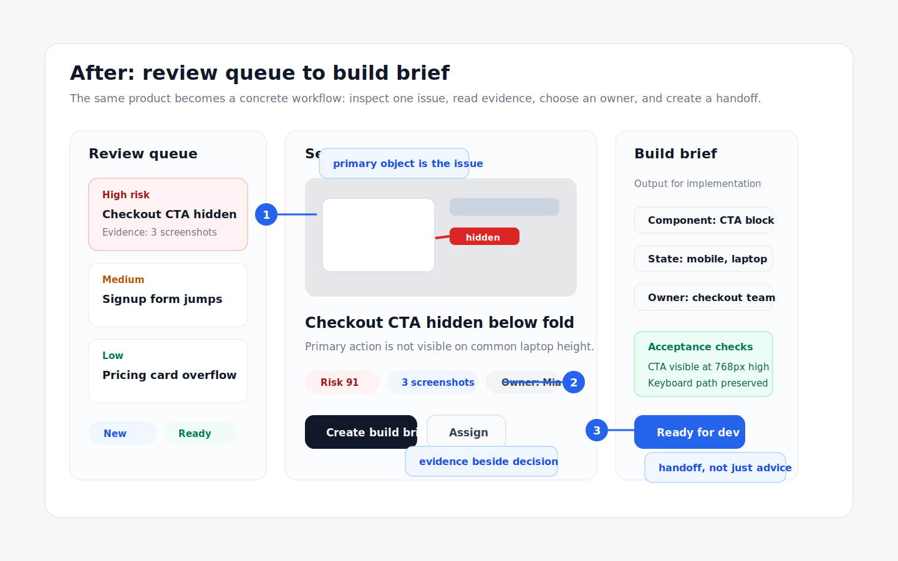

# GPT UI/UX Collaboration Designer

This repo packages the Codex skill `gpt-image-ux-partner`.

It turns GPT image generation into a practical UI/UX collaborator: divergent design boards, critique/redlines, failure scouting, convergence rounds, and implementation-ready design or asset briefs.



## Simple Proof

Example scenario: improve a product team's UI review workflow so vague AI suggestions become implementation-ready handoffs.

### Before: generic AI dashboard



### After: review queue to build brief



What changed: the center of the product moved from a vague assistant panel to a concrete issue queue. Evidence sits beside the decision, there is one primary action, and the output is a build brief a frontend agent can implement.

Full example: [`examples/design-review-inbox`](examples/design-review-inbox)

## Save Run State

For real multi-round work, the skill can save prompts, image paths, notes, selected direction, and avoid-list as JSON:

```bash
python3 skills/gpt-image-ux-partner/scripts/round_state.py init \
  --file .codex/ux-run.json \
  --project "Design Review Inbox" \
  --cadence final_implementation_gate \
  --scope specific_feature_ux \
  --loop-depth quick
```

## Install With Codex

In Codex, point at this repo and say:

```text
Install the skill from https://github.com/1aday/gpt-ui-ux-collaboration-designer/tree/main/skills/gpt-image-ux-partner
```

Codex's built-in `skill-installer` can also install it directly:

```bash
python3 "${CODEX_HOME:-$HOME/.codex}/skills/.system/skill-installer/scripts/install-skill-from-github.py" \
  --repo 1aday/gpt-ui-ux-collaboration-designer \
  --path skills/gpt-image-ux-partner
```

Restart Codex after installation so the skill is picked up.

## Local Install

If you cloned the repo:

```bash
git clone https://github.com/1aday/gpt-ui-ux-collaboration-designer.git
cd gpt-ui-ux-collaboration-designer
./scripts/install.sh
```

## Use

After installing, invoke it by name:

```text
Use $gpt-image-ux-partner to explore UI/UX directions for this app before coding.
```

Useful prompts:

```text
Use $gpt-image-ux-partner to run a scope-calibrated UI/UX ideation loop for a mobile feature. First ask whether I want step-by-step feedback, an autonomous sprint, or only a final gate before implementation.
```

```text
Use $gpt-image-ux-partner to critique this screenshot, identify failure signals, then converge on an implementation-ready redesign brief.
```

```text
Use $gpt-image-ux-partner to turn the selected mockup into an asset plan: direct extracts, redraw candidates, and missing on-brand assets.
```

## What The Skill Does

- Sets scope first: whole app/site, multi-screen product concept, specific feature, or narrow design problem.
- Starts by asking for collaboration cadence: step-by-step feedback, autonomous sprint, or final implementation gate.
- Uses adaptive loop depth: quick proof, standard exploration, or deeper 3+3 pass.
- Keeps round notes: liked ideas, useful patterns, palette/type signals, layout moves, failure signals, and next prompt changes.
- Synthesizes one cohesive direction before convergence.
- Refines hierarchy, states, responsiveness, realism, and product logic before handoff.
- Treats image output as directional inspiration, not literal implementation truth.
- Converts the selected direction into build briefs, component maps, responsive notes, or asset plans.
- Includes a structured-state helper for saving prompts, image paths, notes, decisions, and avoid-lists.

## How It Works

Frame the problem, generate different interaction models, mark what works and fails, converge on one direction, then hand off a build brief.

## Repository Layout

```text
assets/
  gpt-ui-ux-collaboration-designer-featured.svg
  examples/
examples/
  design-review-inbox/
skills/gpt-image-ux-partner/
  SKILL.md
  agents/openai.yaml
  references/
  scripts/round_state.py
scripts/install.sh
```

## Validate

From the repo root:

```bash
python3 "${CODEX_HOME:-$HOME/.codex}/skills/.system/skill-creator/scripts/quick_validate.py" \
  skills/gpt-image-ux-partner
```

The expected result is:

```text
Skill is valid!
```
